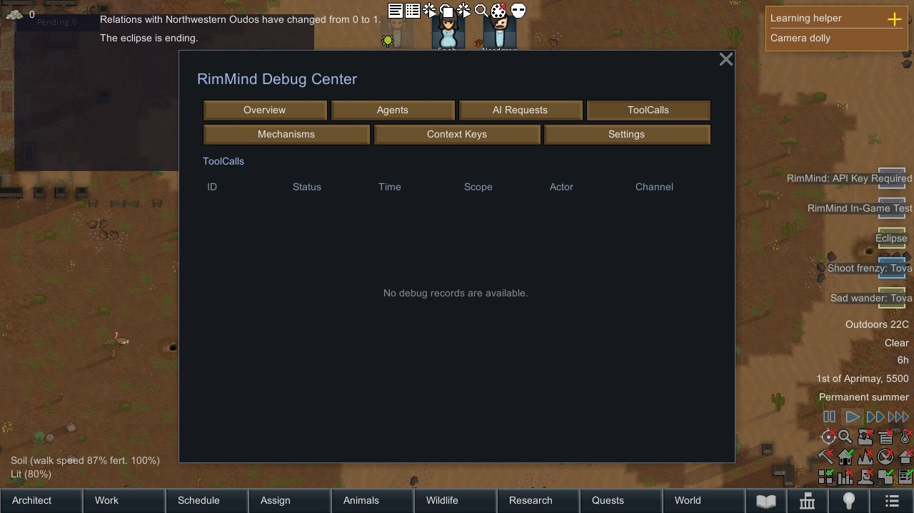
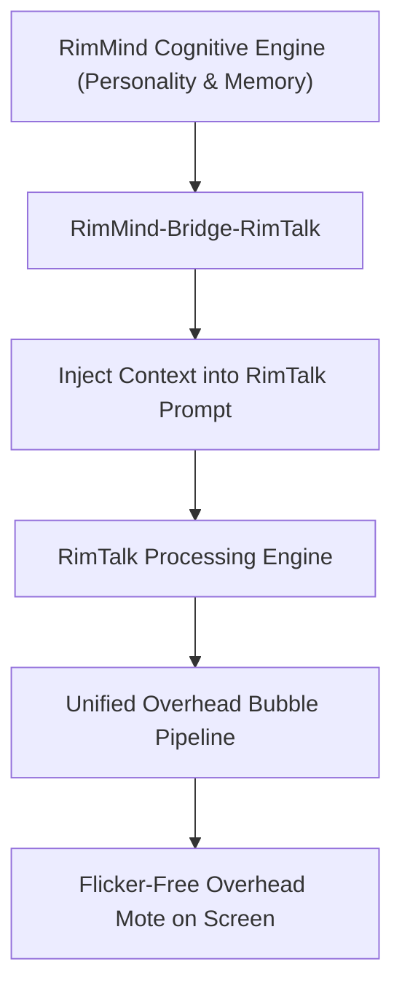

<div align="center">

# RimMind-Bridge-RimTalk 🎨
### Speech Bubble Pipeline Harmonization & Cognitive Bridge for RimWorld 1.6

**English** | [简体中文](README_zh.md)

<p>
  <a href="https://rimworldgame.com/"></a>
  <a href="https://github.com/mcocdaa/RimWorld-RimMind-Mod-Core"></a>
  <a href="#"></a>
  <a href="LICENSE"></a>
</p>

<p><em>Harmonize overhead dialogue bubbles and inject RimMind's deep personality into RimTalk.</em></p>

</div>

---

## 📖 Overview

**RimMind-Bridge-RimTalk** provides an aesthetic rendering bridge between **RimMind** and the renowned **RimTalk** dialogue mod. Rather than having two competing speech bubble renderers clash on screen, this bridge unifies the visual pipeline and injects RimMind's Big-Five personality profiles and episodic memories into RimTalk prompts.

### Key Capabilities
- **Visual Bubble Harmonization**: Shares the overhead mote rendering pipeline, preventing bubble flickering, text clipping, and positioning collisions.
- **Cognitive Prompt Injection**: Dynamically injects RimMind's multi-tier memories and Big-Five traits into RimTalk conversations for deeper, more characterful dialogue.
- **Mutual Cooldown Management**: Coordinates interaction timing between both mod engines to prevent chat spam.

---

## 🎮 In-Game Showcase


*Aesthetic speech bubble rendering: Colonists conversing with RimTalk visual motes powered by RimMind's personality and memory context.*

---

## 🏛️ Pipeline Architecture



---

## 🛠️ Installation & Load Order

```text
1. Harmony
2. Core (Vanilla RimWorld)
3. RimTalk (Optional third-party mod)
4. RimMind-Core
5. RimMind-Bridge-RimTalk
```

---

## 🧪 Developer Guide & Testing

Run unit tests directly:

```powershell
dotnet test RimMind-Bridge-RimTalk/Tests/RimMindBridgeRimTalk.Tests.csproj -c Release
```

---

## 📜 License

Licensed under the [MIT License](LICENSE).
