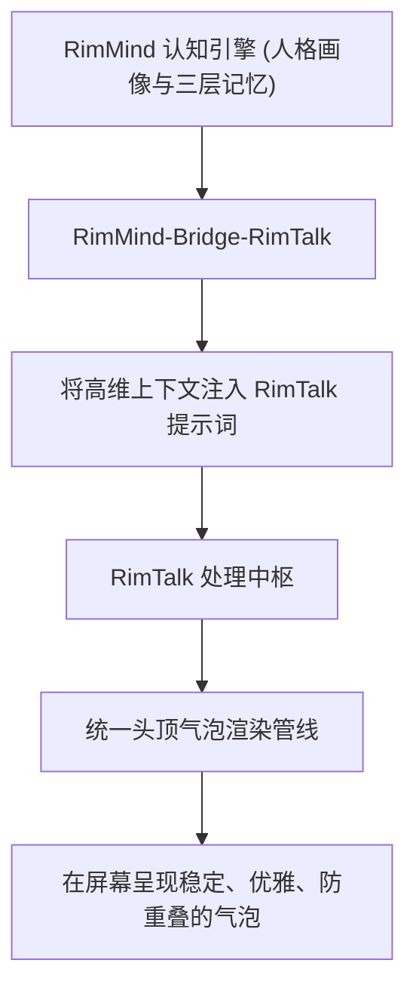

<div align="center">

# RimMind-Bridge-RimTalk 🎨
### 专为 RimWorld 1.6 打造的气泡管线融合、认知记忆桥接与防打架协同系统

[English](README.md) | **简体中文**

<p>
  <a href="https://rimworldgame.com/"></a>
  <a href="https://github.com/mcocdaa/RimWorld-RimMind-Mod-Core"></a>
  <a href="#"></a>
  <a href="LICENSE"></a>
</p>

<p><em>融合头顶气泡渲染管线，将 RimMind 的深度人格与三层记忆赋能至 RimTalk。</em></p>

</div>

---

## 📖 模块概览

**RimMind-Bridge-RimTalk** 为 **RimMind** 与经典对话模组 **RimTalk** 之间搭建了一座优雅的艺术表现力桥梁。它杜绝了两个模组各自定义气泡导致文字遮挡闪烁的问题，实现了渲染管线一体化，并将 RimMind 的大五人格与情节记忆注入 RimTalk。

### 核心特性
- **气泡表现力管线融合**：共享头顶文本粒子渲染管线，消除双重气泡重合、文字截断与闪烁冲突。
- **认知上下文深度赋能**：将 RimMind 的三层记忆库（情节、暗记忆）与大五人格画像动态注入 RimTalk 提示词，让对话更加契合小人生平。
- **对话节奏协同控频**：在底层协调两个模组的交互冷却与触发时序，告别刷屏噪音。

---

## 🎮 实机特性展示


*唯美气泡协同实机：借助 RimTalk 的气泡渲染表现力，呈现由 RimMind 记忆与人格驱动的生动对话。*

---

## 🏛️ 协同流转架构



---

## 🛠️ 安装与加载顺序

```text
1. Harmony
2. Core (RimWorld 原版)
3. RimTalk (第三方模组，可选)
4. RimMind-Core
5. RimMind-Bridge-RimTalk
```

---

## 🧪 开发者测试指南

运行单元测试：

```powershell
dotnet test RimMind-Bridge-RimTalk/Tests/RimMindBridgeRimTalk.Tests.csproj -c Release
```

---

## 📜 开源协议

本项目采用 [MIT License](LICENSE) 开源许可证。
